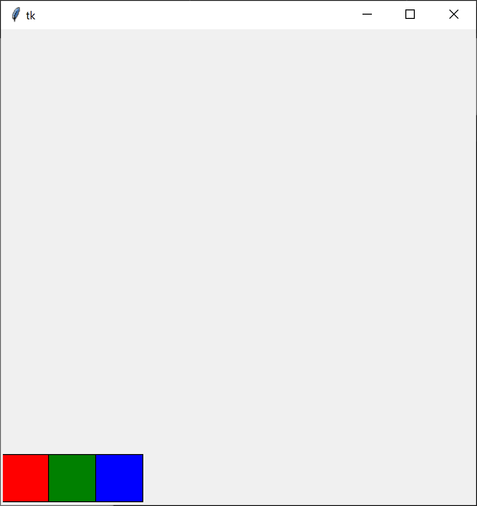

# Create a paint app

## Part 1

Using the below code as a starting point, create a small square wherever the user drags their mouse.

```
from tkinter import *

c = Canvas(Tk(), width = 500, height = 500)
c.pack()

def onMouseClicked(event):
    x = event.x
    y = event.y
    print("Mouse clicked at:", x, y)

def onMouseDragged(event):
    x = event.x
    y = event.y
    print("Mouse dragged at:", x, y)

c.bind("<Button-1>", onMouseClicked)
c.bind("<B1-Motion>", onMouseDragged)

mainloop()
```

## Part 2

Calculate the coordinates and create three squares in a row (red, green, and blue) at the bottom left corner of the window like in the image below.



Extend the mouse-click callback function to detect if a mouse click is inside the bounds of one of these three squares. If it is, set a global `colour` variable to the corresponding colour and use it to change the colour of your "brush". Set the named variable `outline` to the same colour as `fill` to avoid black outlines.

## Extra


- Extract the colour picking logic into a separate function called `isPointInBoundingBox(pX, pY, bMinX, bMinY, bMaxX, bMaxY)` which returns `True` if the point (pX, pY) is inside the box described by (bMinX, bMinY) and (bMaxX, bMaxY) — the top left and the bottom right corners respectively (see image above). If (pX, pY) is not within these bounds, the function should return `False`. Use this function to detect clicks in the coloured squares.
- Check the Tkinter/Canvas documentation to find out how to set keyboard events. Make the `b` key toggle between square and circular brushes, and make the `+` and `-` keys increase and decrease brush size respectively.
- Notice how when the mouse moves too quickly, there are gaps in the drawn lines. Create a third brush that uses the Canvas function `create_line` and previously stored coordinates to draw lines instead of shapes.
- Make the `c` key clear the canvas (refer to Canvas documentation to find out how to clear the canvas) while keeping the colour picker.
