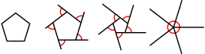

# Draw regular polygons

A regular polygon is a shape that is both equilateral (all sides have the same length) and equiangular (all inner angles are the same). In this exercise, we'll draw these programmatically!

## Part 1

Using the turtle library, draw a square where each side is 50 pixels long. Use a for loop to avoid code repetition. Each iteration of the for loop should draw one side of the square.

## Part 2

Ask the user for a number of sides, and based on the number given, have your program draw any shape. Hint: the image below intuitively shows the relationship between the number of sides and the outer angle of rotation.

## Extra

Find a relationship between the number of sides and the side lengths such that all shapes are the same height/width.

Turn your shape-drawing code into a function that takes the number of sides and the shape size as arguments.

Extend your function such that if given a number below 3 for the number of sides, it prints an error message indicating an invalid argument.

Using a second loop, draw all shapes from 3 sides (triangle) to 8 sides (octagon). You can use the turtle function `clear()` to erase everything that has been drawn between shapes.

Draw a circle.
