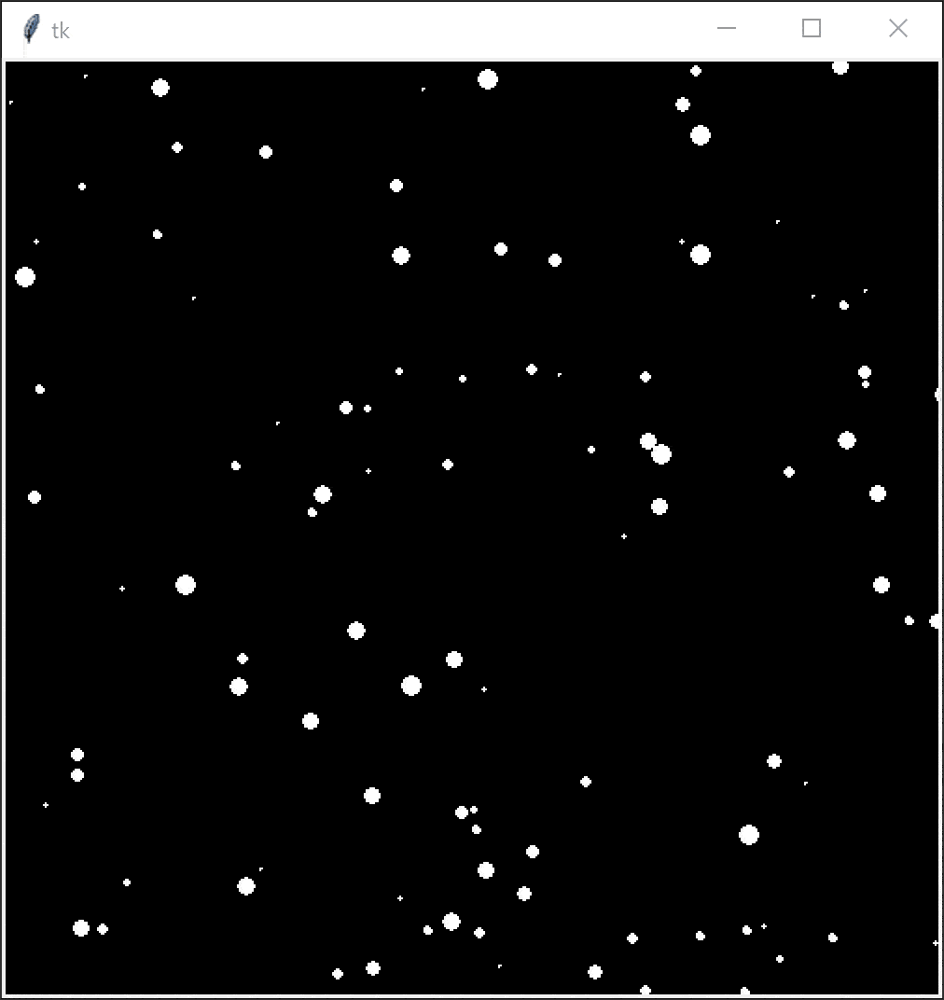

# Create snowfall scene

This exercise is intended to be complete during the final lesson of the term just before Christmas break. This is a walkthrough-style exercise and the teacher should take the students through creating a parallax snowfall scene step by step. Students familiar with OOP should create a snowflake class, otherwise lists like below.

<details><summary markdown="span">Final code
</summary>

```
from tkinter import *
import random

w = 500
h = 500

c = Canvas(Tk(), width = w, height = h)
c.pack()
c.config(background = "black")

xs    = []
ys    = []
sizes = []

for i in range(100):
    xs.append(random.randint(0, w))
    ys.append(random.randint(0, h))
    sizes.append(random.randint(1, 10))

mouseX = 0
mouseY = 0

def render():
    c.delete("all")
    for i in range(100):
        x = xs[i]
        y = ys[i]
        s = sizes[i]

        c.create_oval(x, y, x + s, y + s, fill="white", outline="white")

        ys[i] = ys[i] + (s / 10) * ((mouseY / h) + 1)
        xs[i] = xs[i] + ((mouseX / w) * 2) - 1
        if y > h:
            ys[i] = 0
        if x < 0:
            xs[i] = w
        elif x > w:
            xs[i] = 0
    c.after(10, render)

def onMouseMove(event):
    global mouseX
    global mouseY
    mouseX = event.x
    mouseY = event.y

c.bind("<Motion>", onMouseMove)

render()
mainloop()
```
</details>

## Part 1

Modify the below code such that the snowflake returns back to the top when it reaches the bottom of the window. Do the same horizontally.

```
from tkinter import *

w = 500
h = 500

c = Canvas(Tk(), width = w, height = h)
c.pack()
c.config(background = "black")

size = 10
x = (w - size) // 2
y = -size

def render():
    global x
    global y
    c.delete("all")

    c.create_oval(x, y, x + size, y + size, fill="white", outline="white")
    y = y + 1

    c.after(10, render)

render()
mainloop()
```

## Part 2

Create two empty lists; a list of x coordinates and a list of y coordinates. Values at the same index are paired together. Populate these lists by appending 100 random numbers in the bounds of your canvas width and height.

In your render function, loop over these coordinates and render each. In the same loop, modify the coordinates in the lists to apply motion.

Add a third list of 100 sizes that range from 1 to 10. Use these sizes to determine the radius of a snowflake, as well as how fast it should fall. Bigger snowflakes should fall faster than smaller snowflakes to create a parallax effect.

## Extra



Bind a mouse movement listener to your canvas like below.

```
mouseX = 0
mouseY = 0

def onMouseMove(event):
    global mouseX
    global mouseY
    mouseX = event.x
    mouseY = event.y

c.bind("<Motion>", onMouseMove)
```

Use `mouseX` to create "wind" by having it affect the snowflakes' horizontal speed and `mouseY` to control how fast the snowflakes fall.
