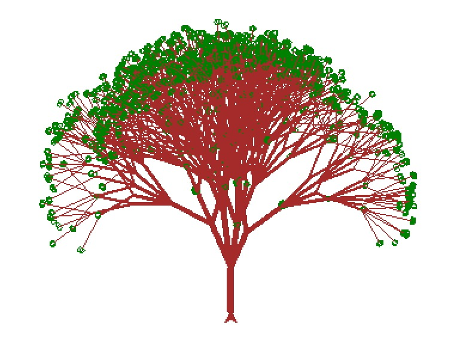

# Draw trees



<details><summary markdown="span">Final code
</summary>

```
from turtle import *
from random import *

tracer(0, 0)
color("brown")
left(90)

minAngle    = 25
maxAngle    = 90
minLength   = 30
maxLength   = 45
minBranches = 2
maxBranches = 6

def tree(depth, branches, size, angle):
  # Terminate at leaf or randomly
  if depth < 1 or branches < 1 or random() < 0.1:
    color("green")
    right(90)
    circle(2)
    left(90)
    color("brown")
    return

  # Set stroke thickness
  width(depth)

  # Draw root/trunk
  forward(size)

  # Turn to leftmost branch
  left(0.5 * angle)
  for i in range(branches):
    # Turn to branch angle
    if branches > 1:
      right(i * angle / (branches - 1))

    # Draw next depth tree
    tree(depth - 1, randint(minBranches, maxBranches), randrange(minLength, maxLength), randrange(minAngle, maxAngle))

    # Turn back to centre angle
    if branches > 1:
      left(i * angle / (branches - 1))

  # Turn back to center
  right(0.5 * angle)

  # Return to start of root
  backward(size)

# Draw tree
tree(6, randint(minBranches, maxBranches), randrange(minLength, maxLength), randrange(minAngle, maxAngle))
update()
```
</details>
